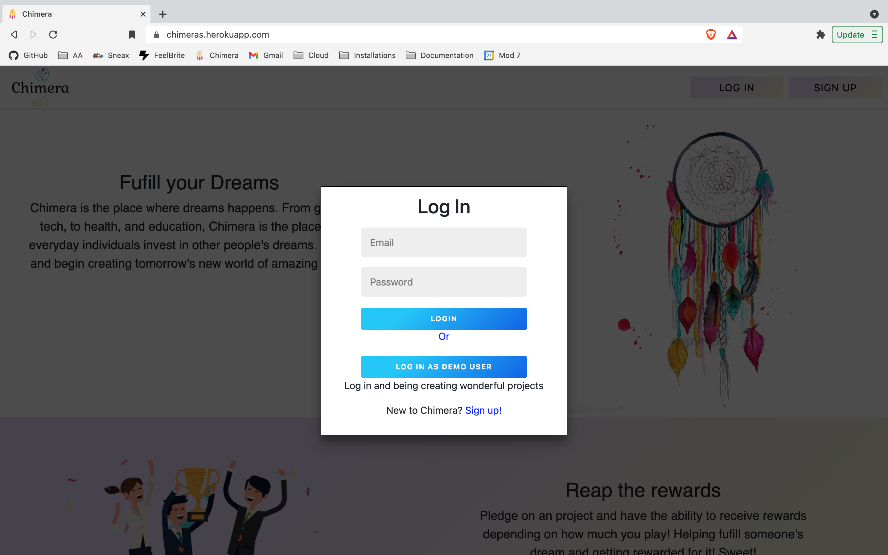

<p align='center'>
  
</p>

# Chimeras
Chimera is a platform that allows people to raise money for events ranging from life events such as celebrations and graduations to challenging circumstances like accidents and illnesses.. It is a fullstack React App made with a Redux state manager and a backend using Python, Flask, SQL-Alchemy, and PostgresSQL and any other technologies. 

* View the <a href='https://chimeras-app.herokuapp.com/'>Chimeras</a> App Live

* Reference to the Chimera <a href='https://www.github.com/{Simonvargas}/{chimera}/wiki'>Wiki Docs</a>

| Table of Contents |
| ----------------- |
| 1. [Features](#features) |
| 2. [Installation](#installation) |
| 3. [Technical Implementation Details](#technical-implementation-details) |
| 4. [Future Features](#future-features) |
| 5. [Contact](#contact) |
| 6. [Special Thanks](#special-thanks) |


## Technologies
* <a href="https://developer.mozilla.org/en-US/docs/Web/JavaScript"></a>
* <a href="https://www.postgresql.org/"></a>
* <a href="https://nodejs.org/"></a>
* <a href="https://reactjs.org/"></a>
* <a href="https://redux.js.org/"></a>
* <a href="https://developer.mozilla.org/en-US/docs/Web/CSS"></a>
* <a href="https://www.python.org/"></a>
* <a href="https://flask.palletsprojects.com/"></a>
* <a href="https://www.heroku.com/home"></a>


## Features

### Sign In and Sign Up



### Feed Page
Chimera feed displays all projects and situations people need aid for.
Discover and search for new projects to help build


### View Projects
Be able to view specific projects and its details


### Add Projects
Add a new Projects to the database


### Update && Delete Projects
On a specific project page, if you own the project, you are able to update your project details or delete the project.


### Support a Project
You can give to support to project by hitting the support button, specifying an amount and leaving an optional comment. 
[Project](./readme-assets/images/support.png)

### View your support
Donations and comments will populate in the backers & donations section in the project page
[{resource-2-plural}](./readme-assets/images/comments.png)

## Edit and Delete your support
In the backers & donations section, one can hit either the trash can icon to delete support or edit to update the comment posted.
[{resource-2-plural}](./readme-assets/images/edit&delete.png)


## Installation
To build/run project locally, please follow these steps:

1. Clone this repository

```shell
git clone https://github.com/Simonvargas/chimera.git
```

2. Install Pipfile dependencies and create the virtual environment
```shell
pipenv install
```

2. Install npm dependencies for the `/react-app`

```shell
cd react-app
npm install
```

3. In the `/` root directory, create a `.env` based on the `.env.example` with proper settings

4. Setup your PostgreSQL user, password and database and ensure it matches your `.env` file

5. Before running any flask commands, confirm you are in the pipenv virtual env. If not, run the command:
```shell
pipenv shell
```

5. In the root folder, create the database by running in the terminal:
```shell
flask db create
```

6. In the root folder, migrate tables to the database by running in the terminal:
```shell
flask db migrate
```

7. In the root folder, seed the database by running in the terminal:
```shell
flask seed all
```

8. Start the flask backend in the `/` root directory
```shell
flask run
```

9. Start the frontend in the `/react-app` directory

```javascript
npm start
```


## Technical Implementation Details

### {Detail 1}
Description 1

Part of code is shown below:

```python
print('add code snippet 1 here')
```

Description 2

```javascript
print('add code snippet 2 here')
```

### {Detail 2}
Description 1

Code snippet is shown here:

```javascript
print('add code snippet 1 here')
```


## Future Features

1. __Search__ - search through a search bar will be implemented in order to provide a more user friendly experience

2. __Second Feature__ - A like feature will be added to each project.


## Contact

### {Your Name}
<a href="https://www.linkedin.com/in/simon-vargas-aa0b6a14b/"></a>
<a href="https://angel.co/u/simon-vargas"></a>
<a href="https://github.com/Simonvargas"></a>

simonvargas01@gmail.com


## Special Thanks
* Fellow peers who have given me support and community: [Andrew](https://github.com/andru17urdna), [Henry](https://github.com/hnrywltn), [Pierre](https://github.com/TheGuilbotine), [Lema](https://github.com/lemlooma), [Meagan](https://github.com/meagan13), [Michelle](https://github.com/michellekontoff), [Nico](https://github.com/nicopierson), [John](https://github.com/Jomix-13), [Manna](https://github.com/makon57), and [Monte](https://github.com/theflaggship)
* Mentors who have given me their time and effort: [Zach](https://github.com/zdwatts), [Olivia](https://github.com/OByrnes), [Ed](https://github.com/edherm), and [Javier](https://github.com/javiermortiz) 
